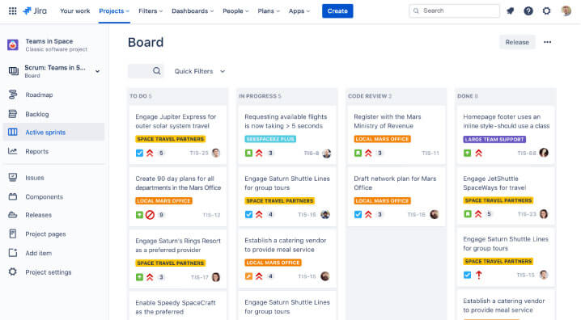
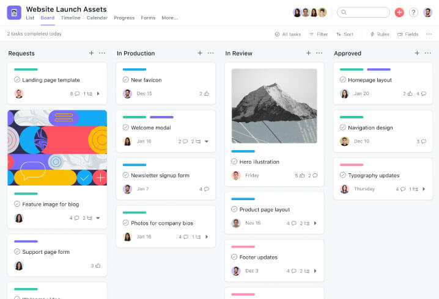

# Material sobre Kanban

> termo “Kanban” é de origem japonesa e significa “sinalização” ou “cartão”, e propõe o uso de cartões (post-its) para indicar e acompanhar o andamento da produção dentro da indústria. Trata-se de um sistema visual que busca gerenciar o trabalho conforme ele se move pelo processo.

## Ferramentas Kanban ajudam em que?

````
    Organização de Demandas: 
 Ajuda uma equipe ou um profissional a visualizar quais são as tarefas que precisam ser feitas, as em execução e as finalizadas, facilitando a delegação e entrega de demandas
 
    Priorização de Tarefas: 
 Auxilia na organizar e classificar as atividades de acordo com a prioridade delas;

    Mapeamento e Estruturação de Processos: 
 Melhora a visualização dos processos de uma empresa ou de uma equipe, ajudando a identificar pontos de melhoria, assim como contribui para que todas as etapas sejam respeitadas.
 ````

 # 3 Boas Ferramentas Kanban

* [Trello](https://trello.com/?&aceid=&adposition=&adgroup=105703213168&campaign=9843285511&creative=437184392158&device=c&keyword=trello&matchtype=e&network=g&placement=&ds_kids=p53016482418&ds_e=GOOGLE&ds_eid=700000001557344&ds_e1=GOOGLE&gclid=Cj0KCQjwyMiTBhDKARIsAAJ-9VtlTaE5gg9r7AaFGyc9mubwBBTbudKbq_DwC3vNorAT6kwoyrTQnTEaAj7VEALw_wcB&gclsrc=aw.ds)
* [Jira](https://www.atlassian.com/software/jira?&aceid=&adposition=&adgroup=89541913902&campaign=9124878219&creative=415542547333&device=c&keyword=jira%20software%20kanban%20board&matchtype=e&network=g&placement=&ds_kids=p51242158955&ds_e=GOOGLE&ds_eid=700000001558501&ds_e1=GOOGLE&gclid=Cj0KCQjwyMiTBhDKARIsAAJ-9VvREZX0mjqq7_zbc0WotMrS_bBvqBaiquNgRSF_tdixCNbzx6gV0lMaAoDZEALw_wcB&gclsrc=aw.ds)
* [Asana](https://www.bitrix24.com.br/alternatives/asana-alternativa-gratuita.php?gclid=Cj0KCQjwyMiTBhDKARIsAAJ-9Vu9lTJIXSSUQbHTHRFKZkAozJNotYzvpWNGYx9ZKFrcuHUJiFtroSsaAqZXEALw_wcB)

## Trello

O Trello é uma ferramenta muito popular para a gestão de tarefas e organização de equipes. O seu funcionamento é totalmente baseado na ferramenta Kanban, pois conta com quadros que podem ser personalizados da maneira que você desejar.

É uma ótima opção para organizar as atividades do seu dia a dia ou do seu time de forma simples e prática. A plataforma é muito intuitiva, contando com uma interface simples que facilita a utilização.


## Jira

O Jira é uma ferramenta voltada à gestão de equipes ágeis que trabalham no desenvolvimento de softwares. Contudo, pode ser adaptada para times de diversas áreas.

Ele também conta com quadros Kanban simples e intuitivos que possibilitam organizar as tarefas da forma desejada. No entanto, possui uma série de outras soluções, como o quadro Scrum e o roteiro de produção.



## Asana

A Asana é uma ferramenta que tem o objetivo de reunir tudo que é preciso para gerenciar equipes em um único lugar. Por isso, possibilita a organização visual de fluxos de trabalho, planejamento de tarefas e muito mais.

Nesse conjunto de soluções, encontra-se o quadro Kanban que, assim como as outras duas ferramentas apresentadas, possui uma interface intuitiva e simples, facilitando o seu uso.



> [Aqui você encontra mais ferramentas e informações](https://gitmind.com/pt/quadro-kanban-online.html)


## Contato: 
[gretzlaff13@gmail.com](https://mail.google.com/mail/u/0/#inbox)  
###### Gabriel Retzlaff ¹³
